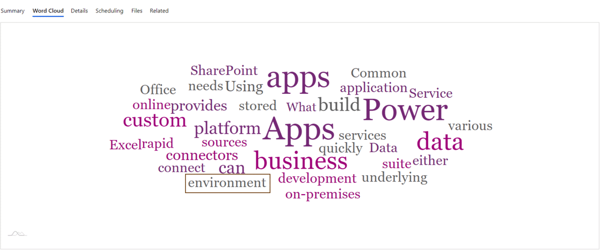

# N-Gram WordCloud PCF
  

## N-Gram Word Cloud
This dataset component provides **PowerApps** users with a customisable word cloud that implements **N-gram**.  
N-gram allows users to know the number of occurencies of **_n_** words within a text.

## Parameters
The component is compatible with several **_text_** data types in **CDS**: SingleLine.Text, SingleLine.TextArea and Multiple.  

The number of words generated by the component can be changed as well as the source field directly from PowerApps.  
In what relates to the n-gram length, users can define **_n_** in accordance to their needs.

From index.ts, users may also add words they don't wish for the component to process to the **stop_words** list.  
In addition, they can modify or add colors to the **colorset** list - by providing the hexadecimal codes of the colors.

### Amcharts
The front-end part of the component uses the following library from Amcharts:   
[Amcharts](https://www.amcharts.com/docs/v4/chart-types/wordcloud/)

Therefore, users can customise even further the word cloud, by modifying the **Configure Series** method from index.ts:  
* Minimum and maximum font size
* Rotation threshold
* Tooltips

## Installation

### Requirements

First of all, users need to have installed:     
* [nodes.js](https://nodejs.org/en/download/)
* [.NET Framework 4.6.2 Developer Pack](https://dotnet.microsoft.com/download/dotnet-framework/net462)
* [Visual Studio 2017 or later](https://docs.microsoft.com/en-us/visualstudio/install/install-visual-studio?view=vs-2017) 
  OR [.NET Core 3.1 SDK ](https://dotnet.microsoft.com/download/dotnet-core/current) + [Visual Studio Code](https://code.visualstudio.com/Download)
* [PowerApps CLI](https://docs.microsoft.com/en-us/powerapps/developer/common-data-service/powerapps-cli)

PowerApps CLI should be updated to its latest version:    
<pre>pac install latest</pre>    

### Building the component

Extract the current rep into a new folder, then open the Developer Command Prompt and search its path. Run:            
<pre>npm install</pre>

In case vulnerabilities are found, run:   
<pre>npm audit fix</pre>

Then build the solution, using:
<pre>msbuild /t:build /restore</pre>  

Create your authentication profile using the command:
<pre>pac auth create --url https://xyz.crm.dynamics.com</pre>

The command prompt will ask for credentials.
Finally, deploy the component, using the push command:    
<pre>pac pcf push --publisher-prefix <your publisher prefix></pre>

## Import the managed solution into CDS

Users may also want to manually import the solution into the CDS.  
They can do so by [downloading](https://github.com/SimonGommeton/PCF_WordCloud/blob/master/Managed%20Solution/NGram_WordCloud_Solution.zip) the solution and importing it using the CDS web portal.

